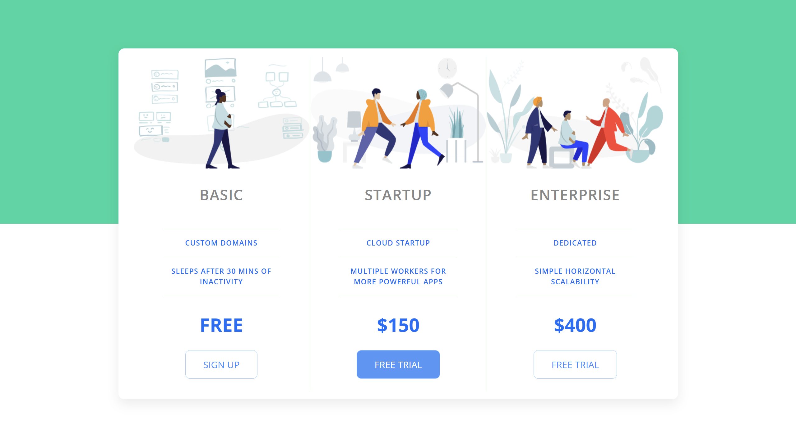

# 👕 Pricing Panel Project

Template of a pricing panel that can be used in a landing page or website that offers an online service (SaaS) or something like that. Feel free to use it and it was taken as a inspiration from a project created by Travis Williamson on codepen.

---

## 📸 Preview



---

## 🌐 Live Demo

🔗 [Watch Live Demo](https://frontendstorenic.netlify.app/)

---

## 🛠️ Tech Stack

- 
- 
- 

---

## 📁 Project Structure

```bash
📦 pricing-panel-project
├── 📁 assets/
├── 📁 css/
├── 📁 img/
├── 🙅🏻‍♂️ .gitignore
├── 📄 index.html
├── 🪪 LICENSE
├── 📖 README.md
```

---

## 📌 Features

- ✅ Responsive Interface
- ✅ Modern And Professional Design
- ✅ Compatibility With Multiple Browsers
- ✅ Optimization For Performance
- ✅ Use Of Images In WebP Format
- ✅ Responsive Web Design Patterns
- ✅ CSS Flexbox Layout

---

## ⚙️ Installation

```bash
git clone https://github.com/Oscar-Arias2001/pricing-panel-project.git
cd pricing-panel-project
```

Open `index.html` in your browser.

---

## 🤝 Contributions

Contributions are welcome. Please open an `issue` or make a `pull request`.

---

## 🧑‍💻 Author

**Oscar Arias**  
🐙 [GitHub](https://github.com/Oscar-Arias2001) </br>
🔗 [LinkedIn](https://www.linkedin.com/in/arias-oscar-8909b025b) </br>
🧸 [Codepen](https://codepen.io/Oscar-Arias-G-)

---

## 📄 License

This project is licensed under [MIT](LICENSE) license.
